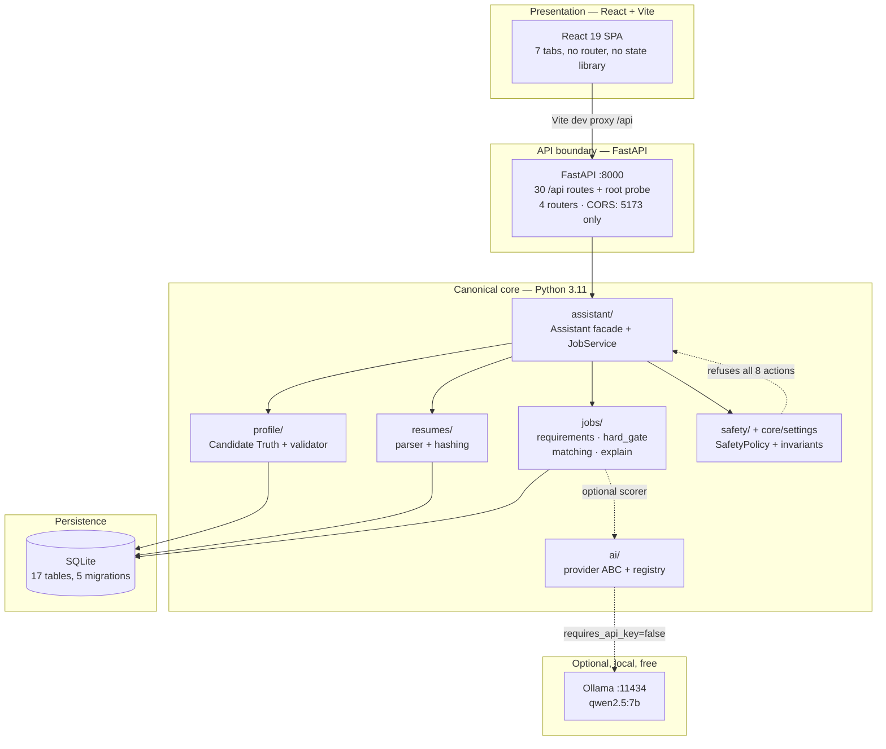
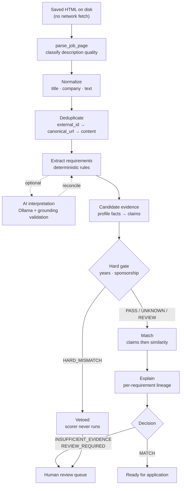
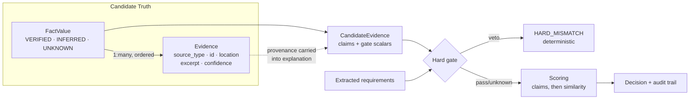
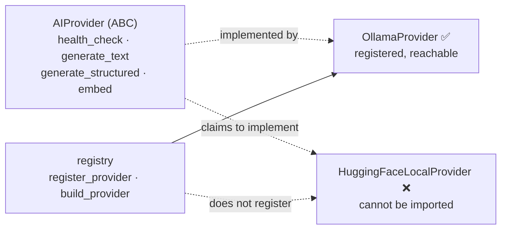
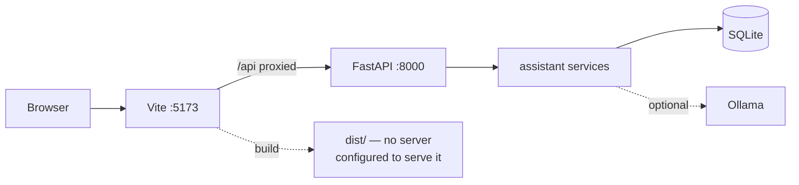

# AI Job Assistant

An evidence-first job analysis system. It maintains a **verified truth model of a real
candidate**, reads job descriptions, and produces an **auditable** verdict on fit —
then stops there.

> ## ⚠️ REAL APPLICATION SUBMISSION IS CURRENTLY DISABLED
>
> There is no code in `src/` that can submit a job application. Not disabled by a
> feature flag alone — there is no submission code path to enable. `POST
> /api/jobs/{id}/apply` always returns `submitted: false`. All 8 privileged safety
> actions are denied by default, and the safety invariants make a permissive
> configuration fail at process startup.
>
> **The legacy Selenium bot at the repository root (`linkedin.py`) can and does submit
> real applications. It is not part of this system, is not reachable from the modern
> CLI or API, and `docker compose up` runs it — not this software.** See
> [Legacy Components](#legacy-components).

---

## Table of Contents

- [Overview](#overview)
- [Project Goal](#project-goal)
- [Problem We Are Solving](#problem-we-are-solving)
- [What The System Does](#what-the-system-does)
- [Current Architecture](#current-architecture)
- [System Flow](#system-flow)
- [Core Components](#core-components)
- [Current Capabilities](#current-capabilities)
- [Current Project Status](#current-project-status)
- [Technology Stack](#technology-stack)
- [Repository Structure](#repository-structure)
- [How It Works](#how-it-works)
- [Safety & Submission Policy](#safety--submission-policy)
- [Installation](#installation)
- [Configuration](#configuration)
- [Running Locally](#running-locally)
- [Testing](#testing)
- [Zero-Cost Local Architecture](#zero-cost-local-architecture)
- [Security & Privacy](#security--privacy)
- [Known Limitations](#known-limitations)
- [Legacy Components](#legacy-components)
- [Future Roadmap](#future-roadmap)
- [Team Development Areas](#team-development-areas)
- [Core Design Principles](#core-design-principles)
- [License](#license)
- [Disclaimer](#disclaimer)

---

## Overview

**AI Job Assistant** is a Python-first system for understanding job postings and
comparing them against a candidate's own verified facts.

The repository has two distinct halves, and it matters which one you are reading:

| | **Modern system** — `src/` | **Legacy bot** — repository root, `legacy/` |
|---|---|---|
| Language | Python 3.11 + TypeScript | Python + Node/TypeScript |
| Entry | `job_assistant.py`, FastAPI, React | `linkedin.py`, `legacy/express-server/` |
| Submits applications | **No** | **Yes** |
| Safety model | Server-enforced invariants | A single `if config.dryRun:` check |
| Status | Active | Quarantined |

Everything below describes the **modern system** unless explicitly labelled legacy.

### Project history

This repository descends from `wodsuz/EasyApplyJobsBot`, a Selenium-based LinkedIn
auto-applier, which was rebranded "Apllie". The original marketing `README.md`,
`linkedin.py`, `config.py`, `utils.py`, `constants.py`, `Dockerfile`, and
`docker-compose.yml` are all still present at the root. The current system was built
*alongside* them and then made canonical; the legacy code was quarantined rather than
deleted so its behaviour stays auditable (`legacy/README.md`).

The project self-describes in its own CLI as:

```
AI Job Assistant - Phase 2 foundation + Milestone 3 job intelligence
(no browser, no submission)
```

---

## Project Goal

Give a job seeker a defensible, evidence-backed answer to **"does this job actually
fit me, and can I prove it?"** — without inventing anything on their behalf.

Concretely, the system is intended to help a candidate:

- understand a job description on its own terms
- extract the requirements a posting actually states
- compare those requirements against **their own recorded, sourced facts**
- evaluate fit with a deterministic hard gate before any scoring happens
- manage resume variants and know which one suits which posting
- keep a human review step in front of anything consequential
- prepare for future applications **without ever submitting one today**

### Current capability vs. long-term vision

| | |
|---|---|
| **Current capability** | Read-only analysis. Offline ingestion of saved HTML. Deterministic extraction. Hard-gate veto. Auditable match verdicts. Human review queue. Evidence-backed profile. |
| **Long-term vision** (not implemented) | Assisted application preparation: plan an application, classify its questions, resolve each answer from verified evidence, rehearse a dry run, and track outcomes — with a human approving every real action. |

The system deliberately stops at the boundary between *analysing* an application and
*submitting* one. That boundary is enforced in code, not by convention.

---

## Problem We Are Solving

Auto-apply tools fail in a specific, predictable way: they confidently answer
questions they do not know the answer to.

A bot that guesses "requires visa sponsorship? yes" can cost a real person a visa or a
job. A bot that invents a skill can produce a résumé that misrepresents them. A bot
that reports a confident "92% match" with no explanation cannot be audited.

This system takes the opposite position:

1. **Unknown is a valid answer.** An empty profile is a *correct* profile, not a bug.
   The codebase states this explicitly: an `UNKNOWN` fact must never carry a value,
   because otherwise "I don't know" becomes indistinguishable from "yes".
2. **Every claim carries its source.** A fact is only `VERIFIED` if something backs it.
3. **Hard requirements are not scores.** Years-of-experience and work-authorisation
   requirements are decided by a deterministic gate *before* any similarity scoring,
   and a gate veto ends the evaluation.
4. **Absence of evidence never becomes a failure.** If the profile does not state years
   of experience, the verdict is `INSUFFICIENT_EVIDENCE` and the job goes to human
   review — not a silent pass, and not a rejection.

The result is a system that can say *"I don't know, and here is exactly what I would
need to know"* — which is the thing a candidate actually needs.

---

## What The System Does

**Does:**

- Maintains an evidence-backed candidate profile with three-state facts
- Validates that profile and reports what is missing for an application
- Ingests resumes (`.txt`, `.md`, `.pdf`, `.docx`) with hashing and duplicate detection
- Parses saved job-posting HTML **offline** — no scraping, no network fetching
- Extracts requirements deterministically, with 21 requirement kinds
- Applies a hard gate on years-of-experience and work-authorisation requirements
- Produces a match verdict with a per-requirement audit trail
- Ranks resume variants against a job by requirement coverage
- Builds an 11-dimension fit report and a review queue
- Optionally uses a **local Ollama** model to interpret a job description, with
  deterministic fallback and a cross-check between the two
- Serves all of the above over FastAPI and renders it in React
- Enforces safety invariants at startup, before the database is even opened

**Does not:**

- Submit applications (no code exists)
- Scrape or crawl job sites (no network client for job boards)
- Fill forms, click buttons, or drive a browser in `src/`
- Answer screening questions
- Tailor, rewrite, or optimise résumés
- Generate cover letters
- Deploy to production

---

## Current Architecture

Three tiers. The React app is presentation only; Python is canonical.



### How the tiers relate

- **React is presentation.** It holds no business logic and makes no decisions about
  fit. Its only write attempt to safety settings is a toast that says it cannot.
- **FastAPI is the API boundary.** It validates, redacts, and refuses. It contains no
  matching logic — it delegates to the service layer.
- **Python is the canonical core.** Every decision — extraction, gating, matching,
  validation — lives here. The TypeScript in `legacy/` is a duplicate, quarantined
  implementation, not a second source of truth.
- **SQLite is local persistence.** One file, gitignored. JSON files are the
  human-editable source of truth; SQLite is a queryable projection.

### Runtime topology

| Tier | Address | Started by |
|---|---|---|
| Vite dev server | `127.0.0.1:5173` | `npm run dev` |
| FastAPI | `127.0.0.1:8000` | `uvicorn api.app:app` with `PYTHONPATH=src` |
| Ollama *(optional)* | `127.0.0.1:11434` | external |

The Vite dev server proxies `/api` → `http://127.0.0.1:8000`, so the browser makes
same-origin requests and CORS is not exercised in the normal dev flow.

---

## System Flow

### Job intelligence pipeline



Stages that exist in code are shown. Stages that do not exist (form filling, submission)
are not shown.

### Candidate truth → matching



---

## Core Components

### Candidate Truth & Evidence

Every leaf field of a candidate profile is a `FactValue`, never a bare string.

| Status | Meaning | Application-safe |
|---|---|---|
| `VERIFIED` | Confirmed by the candidate or a deterministic source they accepted | **Yes** — the only one |
| `INFERRED` | Deterministic parse, or an AI proposal | No |
| `UNKNOWN` | Nothing known. *The correct default, not a defect.* | No |

Model-enforced invariants (`src/core/evidence.py`):

1. `UNKNOWN` must never carry a value — otherwise "I don't know" reads as "yes".
2. `VERIFIED` / `INFERRED` must carry a value.
3. `VERIFIED` must name its source — otherwise nothing is auditable.
4. `extra="forbid"`, `validate_assignment=True` — assignment re-runs validation.

`Evidence` is frozen and immutable, carrying `source_type`, `source_id`,
`source_location`, a `text_excerpt` (truncated at 2000 chars), and a calibrated
`confidence` in `[0,1]` — explicitly *"not how sure the model feels."*

`is_application_safe` requires all three of: known, `VERIFIED`, **and** non-empty
evidence.

Every mutation is written to `fact_change_log` with `actor` and `actor_kind`
(`HUMAN` | `DETERMINISTIC` | `AI`), storing before/after status and value.

**Validation.** `CandidateProfileValidator` runs 10 rule groups and emits 22 stable
codes. It reports; it never repairs. Eight fields are `REQUIRED_FOR_APPLICATION`:
`identity.full_name`, `contact.email`, `contact.phone`, `location.current_country`,
`experience.total_years_experience`, `education.highest_level`,
`authorization.requires_sponsorship`, `availability.available_from`.

### Resume Intelligence

Four extractors, all deterministic, no LLM anywhere in the parse path:

| Format | Backend |
|---|---|
| `.txt` | manual decode over `utf-8`, `utf-8-sig`, `cp1252`, `latin-1` |
| `.md` | delegates to text; markdown syntax deliberately preserved |
| `.pdf` | `pdfplumber` |
| `.docx` | `python-docx` — paragraphs **and** table cells |

- **Identity is content, not filename.** SHA-256 of raw bytes, plus a second
  whitespace-collapsed text hash so the same résumé in a different container collides.
- **Duplicate detection** raises unless explicitly allowed; cross-format duplicates are
  annotated in metadata rather than rejected.
- **A minimum of 80 extracted characters is required** by every extractor, so a scanned
  PDF fails loudly instead of "succeeding" with zero content. There is no OCR.
- **Originals are opened read-only** and never moved, renamed, or overwritten.
- Variants carry `variant`, `role_focus` (a validated slug), `version`, and `skills`.

Relevance lives in `src/jobs/relevance.py` and is **token-coverage only** — no scorer is
passed in. A tie returns `REVIEW_REQUIRED` with no recommendation rather than guessing.

### Job Intelligence

18 modules. The implemented stages are ingestion, normalisation, deduplication,
deterministic extraction, optional AI interpretation, reconciliation, candidate
evidence, hard gate, matching, explanation, an 11-dimension report, relevance, and a
review queue.

**Job status** is a 17-state machine with an explicit transition table. Only two
transitions are actually reachable today (`→ NORMALIZED`, `→ JD_PENDING`); the
repository's own docs note that `APPLYING` and `APPLIED` are retained "because they
already existed" and that **no code in this milestone can reach them.** The transition
method exists and writes an audit row, but has no caller — the state machine is defined,
not driven.

**Hard gate** is narrow by design. It considers only `REQUIRED` requirements that
carry `min_years` or are `SPONSORSHIP`. A veto ends evaluation before scoring runs.

**Matching** applies authority in order: gate veto → exact claim membership →
similarity. A scorer error degrades to `UNKNOWN`, never to a miss.

**Caching** is durable and fingerprint-based:

- analysis → `(job_id, content_hash, analyzer, analyzer_version, prompt_version)`
- match → `(job_id, candidate_id, requirements_fingerprint, candidate_fingerprint, scorer_fingerprint)`

Only `status='SUCCESS'` rows are served, so a failed AI attempt is recorded and then
retried rather than cached as an answer. A failed run is never cached as a success.

### AI Layer

One abstract base class, one registry, **one working provider**.



| | Status |
|---|---|
| `AIProvider` ABC | IMPLEMENTED |
| `OllamaProvider` | IMPLEMENTED — registered, reachable from CLI and status |
| `HuggingFaceLocalProvider` | **BROKEN — cannot be imported** |
| `LexicalScorer` | IMPLEMENTED — the default, offline, zero-dependency |
| `EmbeddingScorer` | PARTIAL — requires a live embedding provider |
| `classify_question_intent` | DISCONNECTED — no importer in `src/` |

Transport is `urllib.request` only — no HTTP client dependency. Errors map to typed
exceptions (`ProviderUnavailableError`, `ProviderTimeoutError`,
`ModelNotFoundError`).

**AI interpretation** of job descriptions is real, opt-in, and grounded
(`src/jobs/interpret.py`): output is validated against a Pydantic schema, rejected if
ungrounded in the posting, and on any provider failure the deterministic extraction is
returned with `ai_fallback` recorded. A separate `reconcile` step cross-checks the two
extractions.

### Hugging Face

**NOT CURRENTLY FUNCTIONAL.** This is the most important correction relative to older
documentation.

- The model id `sentence-transformers/all-MiniLM-L6-v2` appears in exactly one place in
  `src/`: a constant in `src/ai/huggingface.py`.
- **The module raises `ImportError` on import.** It imports `ModelMetadata` and
  `ModelCapability`, neither of which exists in the codebase. It also implements
  `supports` / `get_metadata` / `get_embeddings` rather than the ABC's methods, so it
  would not satisfy the interface even if the imports were repaired.
- It is **not registered** in the provider registry, and **not imported** by any module
  in `src/`.
- It depends on `fastembed`, which is **not in `requirements.txt`** and is not
  installed. `sentence-transformers`, `torch`, and `transformers` are also undeclared.
- Its design intends **local ONNX inference** (CPU-only, no HF token, no hosted
  Inference API). Nothing in the repository performs hosted inference.
- Its cache directory (`data/models/cache`) does not exist, and there is no prefetch or
  warm-up script.

The frontend's "Hugging Face AI" tab is a placeholder that does not mount its
sub-components, and its status badges are hardcoded strings.

> **Note.** The quarantined Node engine in `legacy/` contains a working-ish
> `@xenova/transformers` implementation. `legacy/README.md` lists among its
> deliberately-preserved defects that it "fell back to a synthetic hash projection
> while still reporting HF semantic inference." The Python port carries the same
> defect class in unimportable form — it substitutes a hash-based trigram vector when
> model loading fails. **Do not treat any of it as a working semantic pipeline.**

### Ollama

The only live AI provider, and genuinely usable.

| Property | Value |
|---|---|
| Default model | `qwen2.5:7b` |
| Base URL | `http://localhost:11434` |
| API key | **Not required** (`requires_api_key = False`) |
| Endpoints used | `/api/tags`, `/api/generate`, `/api/embeddings` |
| Embeddings | Declared supported; note `embedding_model` is unset by default, so it falls back to the chat model |

Ollama is **entirely optional**. Every code path degrades cleanly: if the provider is
unreachable, `ProviderUnavailableError` is raised with no silent fallback, and
deterministic extraction and lexical scoring continue to work. No status endpoint ever
probes the network — `/api/status` reports *configuration*, not reachability, by design.

### Database

SQLite via the standard library. Five plain SQL migrations, no ORM, no Alembic,
applied in filename order and recorded in `schema_migrations`.

**17 tables:** `schema_migrations`, `documents`, `evidence`, `candidate_profiles`,
`candidate_facts`, `fact_evidence`, `resumes`, `resume_sections`, `model_runs`,
`fact_change_log`, `jobs`, `job_requirements`, `job_extraction_runs`, `job_analyses`,
`job_matches`, `job_state_events`, `job_reviews`.

Deliberately **not** created: `applications`, `application_answers`,
`application_events`, `question_memory`. There is no application storage because there
is no application.

WAL enabled, foreign keys on, autocommit with an explicit `transaction()` context
manager, per-thread connections.

### FastAPI

One app factory. 30 operations under `/api` plus a root liveness route — 31 documented
operations in total, across four routers.

| Domain | Routes |
|---|---|
| Status | `/api/health`, `/api/ready`, `/api/status` |
| Profile | read, set one fact, read one fact, validate, completeness, unknown fields |
| Resumes | list, ingest, duplicate check, stored duplicates, variants, sections, read, delete |
| Jobs | list, ingest, reviews, read, analysis, match, report, relevance, explanation, review state, resolve review, apply, delete |

- **Safety invariants are asserted inside the lifespan, before the database is opened.**
  An unsafe configuration fails process startup.
- **No route writes safety settings.** There are zero `PUT` and zero `PATCH` handlers
  in the entire surface, no safety-named path, and no route that mutates the policy.
  This is regression-tested by walking the live OpenAPI document.
- **No status endpoint performs network I/O.**
- `POST /api/jobs/{id}/apply` returns **HTTP 200** with `submitted: false` and a
  refusal reason. (It declares a `403` response it never emits.)
- CORS allows exactly `http://localhost:5173` and `http://127.0.0.1:5173`, credentials
  off. No wildcard.
- Exception handlers map 22 typed domain errors to one `ErrorEnvelope` shape, with
  secrets redacted.
- **No authentication, no rate limiting.** Acceptable for a loopback-bound development
  tool; it is not a public service.

### React

React 19 + Vite 8 + Tailwind CSS 4. Three runtime dependencies (`react`, `react-dom`,
`lucide-react`). No router — a single `activeTab` state. No state library — plain
hooks. No data-fetching library — a hand-rolled typed `fetch` wrapper in `src/lib/api/`.

Seven tabs: Job Matching, Review Queue, Candidate Profile, Resume Vault, Auto-Fill Q&A,
Hugging Face AI, Safety & Guardrails.

| Tab | State |
|---|---|
| Safety & Guardrails | **Wired** (read-only, correctly) |
| Job Matching | PARTIAL — 4 of 10 job endpoints used; the report/explanation/relevance surface `JobDetailModal` is built for is never fetched |
| Review Queue | PARTIAL — derived client-side by filtering `jobs`; the dedicated queue endpoint is unused |
| Candidate Profile | **Wired end-to-end** — edits are diffed and written fact-by-fact via `POST /api/profile` |
| Resume Vault | PARTIAL — list only; ingest unreachable from the UI |
| Auto-Fill Q&A | **Truthful not-implemented panel** — the dead fetches were removed; no endpoints invented |
| Hugging Face AI | **Stub** — renders a placeholder string; sub-components unmounted |

### Safety Layer

`src/safety/` is the only place that decides whether a privileged operation may happen.
**Everything defaults to blocked.**

| Action | Default | Blocked because |
|---|---|---|
| `NAVIGATE` | denied | `allow_browser_navigation=false` |
| `READ_PAGE` | denied | needs browser navigation |
| `FILL_FORM` | denied | `allow_form_filling=false` |
| `CLICK` | denied | `allow_form_filling=false` |
| `UPLOAD_FILE` | denied | `allow_file_upload=false` |
| `ANSWER_QUESTION` | denied | needs form filling; also needs approval |
| `SUBMIT_APPLICATION` | denied | `dry_run=true` — checked *first* |
| `USE_VERIFIED_FACT` | denied | needs form filling |

**0 of 8 permitted by default.** `SafetyPolicy.check()` evaluates hard switches before
approval, so a disabled flag is reported as a disabled flag rather than as a missing
approval.

`assert_phase2_invariants()` raises at startup if `safe_mode`, `dry_run`, or
`require_human_approval` is not true, or if `allow_final_submission` or
`allow_form_filling` is true. There is deliberately no flag to switch it off.

### Browser Automation

`src/` contains **no browser automation and no submission code**. A security test
asserts that no file under `src/` imports `selenium`.

`automation/` exists but is **read-only by design**: it can open a URL and read
`page_source`. It never types, never clicks, never submits. Its own docstring explains
the intent — *"keeping the capability out of the reader is what stops 'just fetch the
listing' from quietly growing into 'just apply'."*

`automation/linkedin_source.py` can build LinkedIn search URLs, but **no module in
`src/` imports it.** It is reachable only from tests, with an injected fetch function.

### Guarding candidate truth from AI

`ProfileService.update_fact()` is the live enforcement point:

- AI writing a `VERIFIED` fact → `ImmutableFactError`
- A `VERIFIED` fact without a source → `ImmutableFactError`
- AI writing `UNKNOWN` with a value → silently demoted to `INFERRED`

`suggest_fact()` is the only route by which AI output may enter a profile, and it
hardcodes `status=INFERRED` with a fixed confidence. `import_facts()` refuses an AI
actor outright.

Actor classification defaults to `AI` for unrecognised writers, so an unnamed or
unknown writer is treated as untrusted. An empty actor name raises rather than
guessing.

> **Honest scoping.** `safety.guards.assert_no_fact_mutation()` — the before/after diff
> guard — is invoked by the acceptance suite and tests, but **not** on the production
> write path. The enforced runtime guard is `ProfileService.update_fact()`. Likewise,
> the `ai_attempts()` regression counter is defined but never called. These are
> verification tools, not live protections.

---

## Current Capabilities

| Capability | Status |
|---|---|
| Evidence-backed candidate profile | IMPLEMENTED |
| Three-state facts with model invariants | IMPLEMENTED |
| Profile validation (22 codes, 8 required fields) | IMPLEMENTED |
| Fact change audit trail | IMPLEMENTED |
| Resume ingest: txt / md / pdf / docx | IMPLEMENTED |
| Resume hashing + duplicate detection | IMPLEMENTED |
| Resume variants + section indexing | IMPLEMENTED |
| Offline job ingest from saved HTML | IMPLEMENTED |
| Deterministic requirement extraction (21 kinds) | IMPLEMENTED |
| Job deduplication (3-tier identity) | IMPLEMENTED |
| Hard gate (years, sponsorship) | IMPLEMENTED |
| Match verdict + per-requirement explanation | IMPLEMENTED |
| 11-dimension report | IMPLEMENTED (one dimension always `NOT_SCORED`) |
| Resume relevance by coverage | IMPLEMENTED |
| Review queue + reason derivation | IMPLEMENTED |
| Durable analysis + match caching | IMPLEMENTED |
| Ollama text + structured generation | IMPLEMENTED |
| Ollama embeddings | PARTIAL — needs `embedding_model` set |
| AI job-description interpretation | IMPLEMENTED, CLI-only |
| AI ↔ deterministic reconciliation | IMPLEMENTED |
| Lexical scorer | IMPLEMENTED (default) |
| Model-run audit records | IMPLEMENTED |
| Acceptance suite (24 steps) | IMPLEMENTED |
| FastAPI boundary (31 operations) | IMPLEMENTED |
| React presentation (7 tabs) | PARTIAL |
| Safety invariants | IMPLEMENTED |
| **Hugging Face embeddings** | **BROKEN — module cannot be imported** |
| Question intent classification | DISCONNECTED |
| Question answering | NOT IMPLEMENTED |
| Résumé tailoring / rewriting | NOT IMPLEMENTED |
| ATS optimisation | NOT IMPLEMENTED |
| PDF/DOCX regeneration | NOT IMPLEMENTED |
| Cover-letter generation | NOT IMPLEMENTED |
| Live job-site scraping | NOT IMPLEMENTED |
| Automated form filling | NOT IMPLEMENTED |
| **Application submission** | **DISABLED — no code path exists** |

---

## Current Project Status

| Area | Status | Notes |
|---|---|---|
| Architecture | IMPLEMENTED | React → FastAPI → Python core → SQLite; legacy quarantined |
| Backend | IMPLEMENTED | 31 routes, safety asserted pre-DB, no safety write path |
| Frontend | PARTIAL | Builds and typechecks clean; 3 of 7 tabs incomplete |
| Candidate Truth | IMPLEMENTED | Model invariants enforced; AI cannot create `VERIFIED` |
| Resume | IMPLEMENTED | 4 formats, deterministic, duplicates detected, no tailoring |
| Job Intelligence | IMPLEMENTED | Full analysis pipeline; state machine defined but not driven |
| AI (Ollama) | IMPLEMENTED | Live, local, no API key; optional with clean degradation |
| AI interpretation | PARTIAL | CLI only; not exposed over HTTP |
| Hugging Face | BROKEN | Module raises `ImportError`; unregistered; deps undeclared |
| Ollama | IMPLEMENTED | Optional; unreachable provider fails loudly, never silently |
| Browser Automation | DISABLED | None in `src/`; `automation/` is read-only and unwired |
| Application Intelligence | NOT IMPLEMENTED | No `ApplicationPlan`, `FormField`, `ApplicationSession`, `AnswerEvidence` |
| Submission | DISABLED | No code path; not enableable by configuration |
| Packaging | PARTIAL | `pyproject.toml` declares all runtime deps; the `profile` package name still collides with the stdlib, so `src/` must precede stdlib on `sys.path` |
| Docker | IMPLEMENTED | Image runs the canonical FastAPI app; no browser, no legacy bot |
| Test suite | IMPLEMENTED | 1153 tests passing |

---

## Technology Stack

Only currently-used technologies are listed.

| Layer | Technology |
|---|---|
| **Frontend** | React 19, Vite 8, Tailwind CSS 4, TypeScript 7, `lucide-react` |
| **API** | FastAPI, Uvicorn, Pydantic v2, Starlette CORS middleware |
| **Core language** | Python 3.11 |
| **Database** | SQLite via `stdlib sqlite3` (WAL, FKs on) — no ORM |
| **Validation / config** | Pydantic v2, `pydantic-settings` |
| **Resume parsing** | `pdfplumber` (PDF), `python-docx` (DOCX), `stdlib` (TXT/MD) |
| **AI provider** | Ollama over `urllib` (HTTP, no client library) |
| **Embeddings** | Lexical scorer (`stdlib`); embedding scorer via Ollama |
| **Browser automation** | None in `src/`. `automation/` uses Selenium *read-only* |
| **Testing** | `pytest` (1153 tests) |
| **Frontend testing** | **None** — no JS runner configured |
| **Config** | `.env` + `pydantic-settings`; `.env.example` |
| **Build** | Vite (frontend). No Python packaging — run from source |

Not present: no ORM, no Alembic, no Redis, no message queue, no Docker image for the
modern system, no CI configuration, no auth layer.

---

## Repository Structure

```
.
├── src/                      # ← the canonical system
│   ├── api/                  # FastAPI boundary: app factory, 4 routers, schemas, errors
│   ├── assistant/            # Assistant facade, JobService, ProfileService wiring, CLI, acceptance
│   ├── audit/                # Structured audit events + logger façade
│   ├── core/                 # Cross-cutting: settings, safety enums, evidence, errors, actors, hashing
│   ├── database/             # SQLite connection, transactions, repositories, 5 migrations
│   ├── jobs/                 # Job intelligence: acquisition → requirements → gate → match → explain
│   ├── lib/api/              # Frontend typed API client
│   ├── profile/              # Candidate Truth: models, validator, service
│   ├── resumes/              # Resume parsing, hashing, models, service
│   ├── safety/               # Action policy, approval tokens, fact-mutation guards
│   ├── components/           # React components (one per tab + shared)
│   ├── types/api.ts          # TS mirror of the FastAPI response schemas
│   ├── App.tsx               # React root; tab state and data loading
│   └── vite-env.d.ts
├── automation/               # Read-only page fetching. Never imported by src/
├── tests/                    # 1153 pytest tests + synthetic fixtures
├── docs/                     # Architecture and milestone notes (partly outdated — see below)
├── legacy/                   # QUARANTINED: duplicate Node engines. Do not reactivate
├── data/                     # Local runtime data. Gitignored.
├── job_assistant.py          # CLI entrypoint (sys.path shim → assistant.cli)
├── linkedin.py               # ⚠️ LEGACY Selenium auto-applier. Can submit.
├── config.py / utils.py / constants.py   # ⚠️ LEGACY bot config and helpers
├── Dockerfile / docker-compose.yml       # Canonical FastAPI image (no browser, no legacy bot)
├── package.json / vite.config.ts / tsconfig.json
├── requirements.txt          # thin shim: installs the project plus the [dev] extra
└── .env.example
```

### Notable documentation drift

Several files in `docs/` describe an intended system rather than the running one.
Treat them as design history, not specification:

- `docs/HUGGINGFACE_LOCAL_PROVIDER.md` describes a milestone whose Python
  implementation cannot be imported.
- `docs/SETUP.md` states "903 tests"; the actual count is **1153**.
- `docs/R1B_RECOVERY_STATUS.md` documents a `/api/ai/status` route that does not exist,
  describes `apply` as returning `403` when it returns `200`, and gives resume
  sub-resource paths that are actually candidate-scoped.

---

## How It Works

### A single job, end to end

1. **Capture** — a posting is saved to disk as HTML. Nothing is fetched. `job discover`
   parses local files; its `--url` flag records provenance and is never requested.
2. **Parse & classify** — description quality is graded (partial ≥150 chars, complete
   ≥400). A page that asks for verification instead of showing the posting is classified
   `BLOCKED` and **fails**. It is not retried, solved, or worked around.
3. **Normalise & deduplicate** — identity resolves in three tiers: external id, then
   canonical URL, then content hash.
4. **Extract requirements** — a deterministic rule engine finds required/preferred
   statements, classifies 21 kinds, and extracts minimum years. Optionally an Ollama
   model interprets the description instead; its output is schema-validated against the
   posting and reconciled against the deterministic result.
5. **Build candidate evidence** — verified profile facts become claims plus the two
   gate scalars. Provenance is carried through.
6. **Hard gate** — required years-of-experience and sponsorship requirements are
   evaluated deterministically. A veto ends evaluation; the scorer never runs.
7. **Match** — exact claim membership first, then similarity. Missing data yields
   `UNKNOWN`, never a failure.
8. **Explain** — one audit row per requirement, citing both the posting text and the
   candidate field it came from. An unevaluated row is never filled in.
9. **Review** — anything doubtful is queued with a named reason for a human.

### Caching

Repeat work is cheap and correct:

- Re-analysing an unchanged description returns the cached result.
- Re-matching returns the cached verdict when requirements, candidate, and scorer
  fingerprints all match.
- A **failed** AI run is recorded but never served, so the next attempt retries.
- Gate results and scores are deliberately **not** cached standalone — a partial cache
  is worse than none, because it cannot be spotted.

---

## Safety & Submission Policy

### Real application submission is currently disabled.

This is structural, not configurational.

**Layer 1 — defaults.** `allow_final_submission=false`, `dry_run=true`,
`safe_mode=true`, `require_human_approval=true`.

**Layer 2 — construction.** A Pydantic model validator makes `allow_final_submission=true`
*unconstructible* unless safe mode and dry-run are both off and human approval is on.

**Layer 3 — startup assertion.** `assert_phase2_invariants()` raises `ConfigurationError`
if the permissive combination is ever assembled. It runs inside the FastAPI lifespan
**before the database is opened**, so an unsafe config never serves a request. It is
re-checked on every `/api/ready`.

**Layer 4 — policy check.** `SafetyPolicy.check()` refuses `SUBMIT_APPLICATION` on
`dry_run` first, then on the submission flag, then safe mode, then approval.

**Layer 5 — no implementation.** There is no form-filling code, no submit control, no
browser driver in `src/`. A security test asserts no file under `src/` imports
`selenium`.

### The boundary is fail-closed

`enforce_source_mode()` allows exactly eight read-and-analyse actions — `DISCOVER`,
`FETCH`, `PARSE`, `NORMALIZE`, `PERSIST`, `READ`, `ANALYZE`, `MATCH`. Everything else,
including any unrecognised action, raises `ApplicationBoundaryError`. The allowlist
cannot be widened by adding a caller.

### What the AI may and may not do

| | |
|---|---|
| **May** | Propose a fact as `INFERRED` via `suggest_fact()` |
| **May** | Interpret a job description, grounded and schema-validated |
| **May not** | Create a `VERIFIED` fact — raises `ImmutableFactError` |
| **May not** | Change or remove a verified fact |
| **May not** | Write to a real application form |

### Anti-evasion posture

`src/` and `automation/` contain **no** CAPTCHA solving, MFA bypass, anti-detection,
user-agent spoofing, proxy rotation, or rate-limit evasion.

Blocked pages are *detected and refused* with a typed `SOURCE_BLOCKED` error. This is
refusal, not circumvention.

The legacy root scripts **do** contain anti-detection (`selenium-stealth`,
`--disable-blink-features=AutomationControlled`) and randomised delays. Those belong to
the legacy bot and are **not** a supported feature of this system.

---

## Installation

### Prerequisites

| Requirement | Version | Required |
|---|---|---|
| Python | 3.11+ | **Yes** |
| Node.js | 20+ (verified on 24.19.0) | **Yes**, for the frontend |
| SQLite | ships with Python | **Yes** |
| Ollama | any recent | Optional |
| Git | any | Recommended |

### Backend / CLI

```bash
git clone <repo-url>
cd job-applying-bot

python -m venv .venv
# Windows:      .venv\Scripts\activate
# macOS/Linux:  source .venv/bin/activate

pip install -r requirements.txt          # or: pip install -e ".[dev]"
```

Dependencies are declared in `pyproject.toml`; `requirements.txt` is a thin shim that
installs the project plus the `[dev]` extra. `fastapi` and `uvicorn` are declared, so a
clean install can start the API.

> ### ⚠️ Known limitation: the `profile` package name
>
> `src/profile` collides with the **`profile` module in the Python standard library**,
> which still ships in Python ≤ 3.11 (it was removed in 3.12). The standard library
> precedes `site-packages` on `sys.path`, so `import profile` resolves to the stdlib
> profiler and every canonical import fails — for *any* installed distribution, on
> Windows and Linux alike.
>
> This is why the two supported entry points both prepend `src` to `sys.path`
> (`job_assistant.py` and `tests/conftest.py`), and why the Dockerfile sets
> `PYTHONPATH=/app/src`. It is also why no console script is declared.
>
> **Practical effect:** run the project from a checkout using `python job_assistant.py`
> or `PYTHONPATH=src uvicorn api.app:app`. A properly fixing this means renaming the
> package, which is a structural change and deliberately out of scope for now.

Initialise the database:

```bash
python job_assistant.py db init
```

### Frontend

```bash
npm install
```

### Optional: Ollama

```bash
ollama serve
ollama pull qwen2.5:7b
```

Fully optional. Without it, everything except AI interpretation and embedding-based
scoring still works via deterministic extraction and the lexical scorer.

---

## Configuration

Copy the template and edit:

```bash
cp .env.example .env      # Windows: copy .env.example .env
```

`.env` is gitignored. **Never commit real credentials.**

Section fields use a double underscore — `ASSISTANT_SAFETY__DRY_RUN` configures
`safety.dry_run`.

### Variables actually read by the current runtime

| Variable | Default | Notes |
|---|---|---|
| `ASSISTANT_APPLICATION__NAME` | `AI Job Assistant` | Display name |
| `ASSISTANT_APPLICATION__CANDIDATE_ID` | `primary` | Candidate key |
| `ASSISTANT_DATABASE__PATH` | `data/assistant.db` | SQLite file |
| `ASSISTANT_DATABASE__ENABLE_WAL` | `true` | |
| `ASSISTANT_SAFETY__SAFE_MODE` | `true` | **Invariant** |
| `ASSISTANT_SAFETY__DRY_RUN` | `true` | **Invariant** |
| `ASSISTANT_SAFETY__REQUIRE_HUMAN_APPROVAL` | `true` | **Invariant** |
| `ASSISTANT_SAFETY__ALLOW_FINAL_SUBMISSION` | `false` | **Invariant** |
| `ASSISTANT_SAFETY__ALLOW_FORM_FILLING` | `false` | **Invariant** |
| `ASSISTANT_SAFETY__ALLOW_BROWSER_NAVIGATION` | `false` | |
| `ASSISTANT_SAFETY__ALLOW_FILE_UPLOAD` | `false` | |
| `ASSISTANT_SAFETY__MAX_APPLICATIONS_PER_RUN` | `5` | |
| `ASSISTANT_SAFETY__BLOCK_ON_CAPTCHA` | `true` | A blocking switch, not a bypass |
| `ASSISTANT_SAFETY__BLOCK_ON_MFA` | `true` | A blocking switch, not a bypass |
| `ASSISTANT_AI__PROVIDER` | `ollama` | Only `ollama` is registered |
| `ASSISTANT_AI__MODEL` | `qwen2.5:7b` | |
| `ASSISTANT_AI__BASE_URL` | `http://localhost:11434` | |
| `ASSISTANT_AI__EMBEDDING_MODEL` | *(empty)* | Empty ⇒ falls back to the chat model |
| `ASSISTANT_AI__API_KEY` | *(empty)* | Hosted providers only |
| `ASSISTANT_LOGGING__LEVEL` | `INFO` | |
| `ASSISTANT_LOGGING__FORMAT` | `json` | |
| `ASSISTANT_LOGGING__LOG_RESUME_BODIES` | `false` | Keep false — résumé bodies are private |
| `VITE_API_BASE` | `/api` | Frontend only; unset → rides the Vite proxy |

The five safety invariants are asserted at startup. Changing one to a permissive value
**prevents the process from booting** — this is intended.

Legacy flat names at the bottom of `.env.example` (`DRY_RUN`, `LINKEDIN_*`,
`APPLICANT_*`) belong to the legacy bot and are read by `linkedin.py`.

> `ApiSettings` (host, port, CORS origins) is configurable via
> `ASSISTANT_API__*` but is **not documented in `.env.example`**. Its defaults are
> correct for local development.

---

## Running Locally

You need **two terminals**. There is no combined script.

### Terminal 1 — API

`src/` must be on `PYTHONPATH`. There is no packaging metadata, so nothing does this
for you.

```bash
# Windows PowerShell
$env:PYTHONPATH="$PWD\src"
python -m uvicorn api.app:app --host 127.0.0.1 --port 8000
```

```bash
# macOS / Linux
PYTHONPATH=src python -m uvicorn api.app:app --host 127.0.0.1 --port 8000
```

The factory form also works:

```bash
PYTHONPATH=src python -m uvicorn api.app:create_app --factory --host 127.0.0.1 --port 8000
```

Verify:

```bash
curl http://127.0.0.1:8000/api/ready
# {"status":"ready","checks":{"sqlite.readable":true,"schema.migrated":true,"safety.invariants":true},...}
```

Interactive API docs: <http://127.0.0.1:8000/docs>

### Terminal 2 — Frontend

```bash
npm run dev
```

Serves <http://127.0.0.1:5173> and proxies `/api` → `127.0.0.1:8000`.

> The Navbar renders a hardcoded `"Port 3000 Verified"` label. The real dev port is
> **5173**.

### CLI — no server needed

```bash
python job_assistant.py status              # safety, paths, DB counts, redacted config
python job_assistant.py safety              # which privileged actions are permitted
python job_assistant.py db init             # create + migrate the database
python job_assistant.py db tables           # list tables

python job_assistant.py profile init        # create an empty profile
python job_assistant.py profile show
python job_assistant.py profile set identity.full_name "Example Name"
python job_assistant.py profile validate
python job_assistant.py profile unknown

python job_assistant.py resume ingest PATH [--variant ...] [--role-focus ...]
python job_assistant.py resume list
python job_assistant.py resume show ID

python job_assistant.py ai health           # live provider probe (the CLI does probe)
python job_assistant.py ai models

python job_assistant.py job list
python job_assistant.py job discover PATH   # offline: parses local HTML files
python job_assistant.py job ingest PATH
python job_assistant.py job analyze ID [--ai] [--model ...]
python job_assistant.py job match ID [--scorer none|lexical|embedding]
python job_assistant.py job report ID
python job_assistant.py job relevance ID
python job_assistant.py job explain ID
python job_assistant.py job queue
python job_assistant.py job resolve ID --note "..."

python job_assistant.py acceptance          # 24-step acceptance run
```

Global flag: `--env-file PATH`.

Exit codes: `78` configuration error, `1` assistant error, `130` interrupt.

`job discover` reads **local files only**. Its `--url` flag is recorded as provenance
and never fetched. There is no live job scraping anywhere in `src/`.

### Web application workflow



**PARTIAL.** The dev path works. A production `dist/` bundle is generated by
`npm run build` but **no server or reverse proxy is configured to serve it**, and the
frontend assumes a same-origin `/api`. There is no deployment configuration in this
repository.

---

## Testing

**Framework:** `pytest`. **No config file** — `tests/conftest.py` arranges `sys.path`
directly.

```bash
python -m pytest                       # full suite
python -m pytest -q                    # quiet
python -m pytest tests/test_safety.py  # single file
```

**Verified during this audit: `1153 passed`, 0 failures, 0 errors** (Python 3.11.8,
pytest 8.3.3). Eleven warnings, all a cosmetic `HTTP_422` deprecation.

> `docs/SETUP.md` says 903 tests. That figure is stale.

### Coverage categories

| Area | Files |
|---|---|
| Requirements extraction | `test_job_requirements.py` (106 tests) |
| Persistence, dedup, caching | `test_job_persistence.py`, `test_job_analysis.py` |
| Offline discovery & page parsing | `test_job_discovery.py`, `test_job_extraction.py` |
| Gate & matching authority order | `test_job_hard_gate.py`, `test_job_matching.py` |
| Explanation lineage | `test_job_explain.py` |
| 11-dimension report | `test_job_dimensions.py` |
| Review queue | `test_job_review.py` |
| AI interpretation & reconciliation | `test_job_interpret.py`, `test_job_reconcile.py` |
| Relevance | `test_job_relevance.py` |
| Candidate truth & evidence | `test_core_evidence.py`, `test_profile.py` |
| Resumes & hashing | `test_resumes.py` |
| Safety | `test_safety.py` |
| **Security** | `test_security.py` |
| API boundary | `test_api.py` |
| CLI | `test_job_cli.py` |
| Acceptance | `test_acceptance.py` |
| Legacy still-importable | `test_legacy.py` |

### Acceptance tests

`src/assistant/acceptance.py` runs **24 numbered steps** entirely locally against
synthetic fixtures and a temp database. It opens no browser and submits nothing. Step 17
asserts that `SUBMIT_APPLICATION`, `FILL_FORM`, and `NAVIGATE` are all refused, then
performs a real mutation attempt and requires the fact guard to reject it.

`tests/test_acceptance.py` asserts `passed == 24` and byte-compares the real profile file
before and after a run to prove it was never written.

### Security tests

`tests/test_security.py` reads the repository's own git index rather than mocking. It
asserts that no credential-shaped string appears in any tracked file, that `.env` and
the real profile JSON are gitignored, that secrets are redacted from logs and settings
reprs, that **no file under `src/` imports selenium**, and that fixtures contain no
plausible PII.

### Frontend tests

**None.** No JS test runner is configured. The frontend is checked by:

```bash
npm run typecheck     # tsc --noEmit
npm run build         # vite build
npm run verify        # both of the above
npm run test:backend  # the authoritative Python suite
```

> The former `npm test`, `test:hf`, and `test:hf-smoke` scripts were **removed**: they
> pointed at `src/ai/*.ts` files that were quarantined to `legacy/`, so they could only
> ever fail. They were replaced with the commands above rather than pointed at anything
> new.

---

## Zero-Cost Local Architecture

The ₹0 path: a complete local development setup costs nothing. Every component below is
free and self-hosted.

| Component | Cost | Role |
|---|---|---|
| Python 3.11 | Free | Canonical core |
| FastAPI + Uvicorn | Free | API boundary |
| SQLite (bundled) | Free | Persistence |
| Pydantic | Free | Validation |
| React + Vite + Tailwind | Free | Presentation |
| `pytest` | Free | Testing |
| **Ollama** + `qwen2.5:7b` | Free | Optional local AI, **no API key** |
| **Lexical scorer** | Free | Default similarity — pure stdlib, no model, no network |

**With zero external services**, the full deterministic pipeline works: ingest →
extract → gate → match → explain → review. This is the default and intended path.

### Local / free vs. external

**Local and free:** everything in the table above.

**Optional, and *not* free by default:** any hosted AI provider. Setting
`ASSISTANT_AI__API_KEY` implies a hosted provider, and only `ollama` is currently
registered — pointing at a hosted provider raises `ConfigurationError: unknown AI
provider`. There is no code path to a paid service today.

The Hugging Face route, if repaired, would run **local ONNX inference on CPU** and
require no token. It is currently non-functional, so it is not part of any cost path.

---

## Security & Privacy

- **Secrets live outside source.** `.env` is gitignored. `tests/test_security.py` fails
  the build if a credential-shaped string appears in any git-tracked file.
- **Candidate data is local.** SQLite, profile JSON, and résumé files all live under
  `data/`, which is gitignored, including the real `candidate_profile.json`.
- **The example profile is committed; the real one is not.** Only synthetic fixtures and
  `.example.json` are tracked, using `.invalid` domains and obviously-fake phone numbers.
- **Logs are redacted.** `redact()` masks registered secrets in arbitrary text.
  Registration refuses secrets under 3 characters so masking cannot corrupt unrelated
  output. `GET /api/status` returns only `*_present: boolean` for secrets.
- **Résumé bodies are not logged** by default (`LOG_RESUME_BODIES=false`).
- **Model runs store hashes, not prompts.** `ModelRun` records input/output SHA-256 and
  character counts. Prompt bodies are not persisted; the optional preview is clamped to
  280 characters, and credential-shaped metadata keys are rejected.
- **Evidence is immutable and frozen**, so an audit trail cannot be edited after the fact.
- **Safety is server-side.** No API route can modify safety settings; this is
  regression-tested against the live OpenAPI document.
- **Status endpoints never probe the network**, so polling cannot leak traffic patterns
  or incur provider cost.
- **Local-first.** No telemetry, no analytics, no outbound calls except to a
  user-configured AI provider.

**Not yet present:** no authentication, no rate limiting, no request IDs, no CSRF
protection. Appropriate for a loopback-bound development tool; it is **not** hardened
for exposure.

---

## Known Limitations

Resolved during R2-A and listed under [Fixed in R2-A](#fixed-in-r2-a). What remains:

### Functional defects

| Severity | Issue |
|---|---|
| High | **`src/profile` shadows the stdlib `profile` module** on Python ≤ 3.11, so no installed distribution can import the canonical packages. Requires `src` to precede stdlib on `sys.path`. |
| Medium | **`src/ai/huggingface.py` cannot be imported** — it imports three symbols that do not exist and implements the wrong interface. |
| Medium | **The Hugging Face tab renders a placeholder**; all four imported sub-components are unmounted, and its status badges are hardcoded strings rather than derived from the API. |
| Low | 17 of 29 API-client methods are never called, including the whole report/explanation/relevance surface the job detail modal is built for. |
| Low | `tsconfig.json` includes `server.ts`, which no longer exists. |
| Low | The Navbar shows a hardcoded port label. The Vite proxy `rewrite` is an identity function. |
| Low | The API's `apply` route declares a `403` response it never emits. |

### Fixed in R2-A

| Was | Resolution |
|---|---|
| `fastapi`/`uvicorn` undeclared | Declared in `pyproject.toml`; `requirements.txt` installs the project |
| No `pyproject.toml` | Added; explicit package list, migrations shipped via `package-data` |
| Profile edits silently discarded | `handleUpdateProfile` diffs and writes fact-by-fact; a failure re-throws and the tab shows "Nothing was saved" |
| Auto-Fill Q&A called dead endpoints | Fetches removed; replaced with a truthful capability-status panel |
| Résumé parser `NameError` | Module logger added; 3 regression tests |
| `npm test`/`test:hf`/`test:hf-smoke` broken | Removed; replaced with `typecheck`, `build`, `verify`, `test:backend` |
| Docker ran the legacy auto-applier | Rewritten to build and run the canonical FastAPI app |
| `src/lib/` excluded from git by an unanchored `lib/` rule | Rule anchored to `/lib/`; 9 frontend client files recovered |
| `POST /api/profile` dead-ended when the JSON copy was missing | Route re-exports the JSON from the database via the service's existing rebuild path |

### Design limitations

- The job status machine is **defined but never driven**; `APPLYING`/`APPLIED` are
  unreachable by construction.
- One dimension of the 11-dimension report (`seniority_match`) always returns
  `NOT_SCORED`.
- Résumé relevance is lexical coverage only — it receives no scorer.
- Ollama's `embed()` embeds only the first text of a batch.
- `AISettings.max_retries` is parsed but never used; there is no retry loop.
- AI job interpretation is CLI-only and not exposed over HTTP.
- `assert_no_fact_mutation()` and `ai_attempts()` are verification tools, not live
  runtime guards.

### Operational limitations

- `PYTHONPATH=src` must be set for the API, because of the `profile` package collision.
  It is documented and set in the Dockerfile, but not enforced by the tooling.
- Two independent settings control storage — `ASSISTANT_APPLICATION__PATHS_ROOT` and
  `ASSISTANT_DATABASE__PATH`. Setting only the first leaves the database resolving
  relative to the working directory, which can put it outside the intended data tree.
- No reverse proxy or static server for a production `dist/` build.
- No frontend test runner.
- No CI configuration.
- Several files in `docs/` describe an intended system rather than the running one;
  `docs/SETUP.md` also still claims 903 tests.

---

## Legacy Components

The repository contains a second, older system. It is **not** part of the architecture
described above.

### `legacy/` — quarantined duplicate engines

`legacy/README.md` titles it *"QUARANTINED LEGACY CODE — DO NOT RE-ACTIVATE"* and
states that if a capability is missing from the Python core, *"it is missing. It is not
a reason to re-enable anything in this directory."*

It holds a Node/TypeScript Express server with **second implementations** of AI
providers, embedding caches, hard-gate logic, matching, and relevance — plus one Python
file that imports seven symbols which no longer exist and **cannot execute**.

Defects deliberately preserved for audit, per `legacy/README.md`:

1. Bound `0.0.0.0` with unrestricted CORS and **no authentication**.
2. `PUT /api/safety` let **any unauthenticated caller** enable real submission.
3. The apply route reported a live submission that never happened, even in dry-run.
4. Candidate PII hardcoded in source.
5. An embedding scorer that fell back to a synthetic hash projection while still
   reporting semantic inference.

None of this is imported by the Python core, the FastAPI boundary, or the React layer.

### Root-level bot files

| File | Status |
|---|---|
| `job_assistant.py` | **Modern.** A 44-line `sys.path` shim into `assistant.cli`. Not legacy. |
| `linkedin.py` | ⚠️ **Legacy, and it can submit real applications.** |
| `config.py`, `utils.py`, `constants.py` | ⚠️ Legacy bot config and Selenium helpers |
| `additionalQuestions.yaml` | Legacy. Nothing in `src/` reads it. |

`linkedin.py` is a working LinkedIn auto-applier: it applies `selenium-stealth`, logs
in with stored credentials, persists sessions as pickled cookies, and clicks
`Submit application`. Its **only** guard is a hand-written `if config.dryRun: return`,
and `config.py`'s `dryRun` is a plain module constant with no invariant behind it. In
dry-run it still performs the real login and Easy Apply click-through before the check.

### Docker now runs the canonical application

The Dockerfile was rewritten during R2-A. It **previously** copied only root-level
`*.py` (never `src/`), installed Chrome plus ~35 X11 libraries for the legacy bot, and
ran `CMD ["python3", "linkedin.py"]` — an auto-applier under `restart: unless-stopped`.

The current image:

- builds and runs `uvicorn api.app:app`
- contains **no browser, no Chrome, and no Selenium**
- does **not** copy `linkedin.py`, `config.py`, `utils.py`, or `constants.py`
- pins every safety switch to its safe value, so a permissive mistake is a failed
  startup rather than a running-but-unsafe service
- exposes a health check on `/api/ready`, which verifies SQLite, migrations, **and** the
  safety invariants

```bash
docker compose up --build                        # API on http://127.0.0.1:8000
docker compose run --rm cli status               # one-off CLI in the same image
```

The legacy bot is no longer containerised at all.

---

## Future Roadmap

High-level only. All items are **FUTURE**; none is scheduled, and no dates are implied.

- **Application planning** — derive a structured plan from a job and verified evidence,
  as a reviewable artefact rather than an action.
- **Application intelligence** — model questions, form fields, and sessions as
  first-class, evidence-linked domain objects.
- **Question classification** — wire up the existing `question_intent` module behind a
  real API route; the classifier exists and is currently unreachable.
- **Evidence-backed answer resolution** — answer a question *only* from a verified
  fact, and emit `INSUFFICIENT_EVIDENCE` rather than guessing.
- **Human review workspace** — make the review queue a genuine decision surface, with
  side-by-side posting and candidate evidence.
- **Controlled dry-run form workflow** — if browser automation is ever added, keep it
  read-only or dry-run-only, behind the existing fail-closed boundary.
- **Application tracking** — record outcomes and learn from them, once submission is
  ever deliberately enabled.
- **Engineering prerequisites** — add `pyproject.toml` with real dependency
  declarations, complete the requirements manifest, repair or remove the Hugging Face
  module, add a frontend test runner, and serve `dist/` for review.

---

## Team Development Areas

Logical areas for contribution. No individuals are assigned.

| Area | Scope |
|---|---|
| **Backend** | FastAPI routes, Pydantic schemas, error envelopes, packaging (`pyproject.toml`), dependency manifests |
| **Frontend** | Wire the unwired API client methods, fix the profile-save defect, replace the AI tab placeholder, add error and loading states |
| **AI / ML** | Repair or remove `src/ai/huggingface.py`; batch embedding; retry policy; question-intent wiring; evaluation harnesses |
| **Résumé Intelligence** | Additional extractors, OCR path, section detection quality, relevance scoring beyond token coverage |
| **Job Intelligence** | Extraction rule coverage, requirement-kind tuning, the inert `seniority_match` dimension, state-machine wiring |
| **Application Intelligence** | The next domain: plans, questions, answers, sessions — design and implementation |
| **Testing** | Frontend test infrastructure, coverage for the API client, property-based tests for the state machine |
| **Security** | Authn/authz if ever exposed beyond loopback, rate limiting, request IDs, secret-scanning in CI |
| **Documentation** | Correcting the drift in `docs/`, keeping this README accurate as the system changes |
| **Safety** | Keeping the fail-closed boundary intact; reviewing any change that widens an allowlist |

---

## Core Design Principles

1. **Candidate truth over AI assumptions.** An empty profile is a correct profile. The
   system is built to be useful while knowing nothing.
2. **Evidence over unsupported claims.** A fact is only `VERIFIED` if something backs
   it. Nothing is application-safe without evidence.
3. **Hard requirements over opaque scores.** Eligibility is decided deterministically,
   before scoring. A gate veto ends evaluation.
4. **AI assists decisions; it does not invent facts.** It may propose `INFERRED`. It may
   not create `VERIFIED`.
5. **Absence of evidence is not failure.** Unknown yields `UNKNOWN` and a human queue
   item — never a silent pass and never a rejection.
6. **Fail closed.** Unlisted actions are refused. Blocked pages are reported, not
   circumvented. Untrusted writers are assumed.
7. **React is presentation.** It renders and it requests. It decides nothing about fit.
8. **FastAPI is the boundary.** It validates, redacts, and refuses. It holds no domain
   logic.
9. **Python is the canonical core.** One implementation of every decision. Duplicates
   are quarantined, not maintained in parallel.
10. **SQLite is local persistence.** One file, no server, no telemetry.
11. **Safety is enforced server-side.** No client can relax it, because no client can
    write it.
12. **Real application submission remains disabled.** And it is disabled structurally —
    there is no code to enable.

---

## License

**Creative Commons Attribution-NonCommercial-ShareAlike 4.0 International
(CC BY-NC-SA 4.0).**

See [`LICENSE`](./LICENSE). This is inherited from the upstream project and is
**not** MIT. It is unchanged by this documentation update.

The three licence elements are binding:

- **Attribution** — credit the creator, link the licence, indicate changes.
- **NonCommercial** — **the material may not be used for commercial purposes.**
- **ShareAlike** — derivatives must be distributed under the same licence.

**Third-party components** carry their own licences, including `pdfplumber`,
`python-docx`, Pydantic, FastAPI, Uvicorn, React, Tailwind, and Ollama. Any model
weights used would require separate attribution under their own terms; the
`sentence-transformers/all-MiniLM-L6-v2` reference in this repository is currently in
non-functional code.

---

## Disclaimer

- **This is a development project.** It is a working analysis system, not a product,
  and not deployed anywhere.
- **Some capabilities are partial, deferred, or disconnected**, and this document says
  so explicitly. Read the [Current Project Status](#current-project-status) table
  before relying on any feature.
- **Real application submission is currently disabled**, and no code path to enable it
  exists.
- **Automated interaction with job platforms may be subject to those platforms' terms
  of service.** The modern system in `src/` performs no such interaction at all — it
  parses HTML you supply. The legacy bot at the repository root does interact with
  LinkedIn and may breach LinkedIn's terms; it is unsupported, unmaintained, and
  should not be operated.
- **The frontend is a prototype.** Several tabs are incomplete, and one silently
  discards edits. Do not treat it as a system of record.
- **Candidate data is sensitive.** It stays on your machine. Handle `data/` and `.env`
  accordingly.
- No legal conclusions are offered beyond what is verifiable from this repository.

---

**README reflects the verified state of the repository as audited against the source
code. Where documentation and code disagreed, the code won and the discrepancy was
recorded in [Known Limitations](#known-limitations).**